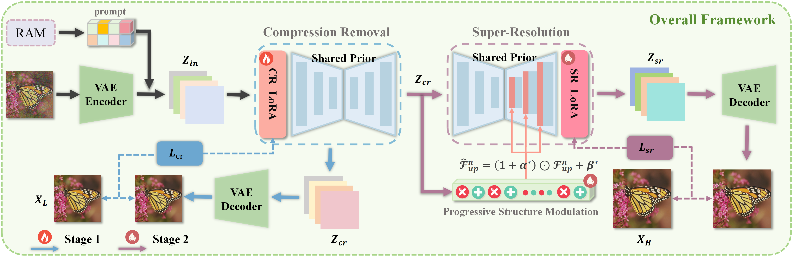

<div align="center">
<h2>A Smooth Decoupling Strategy based on Shared Prior for Compressed Image Super-Resolution</h2>

🚩 Accepted by ICME 2026(Spotlight)

<!-- <a href="#"></a> -->
<a href="LICENSE"></a>

[Wenjian Zhang](https://scholar.google.com/citations?user=w3H4nRoAAAAJ&hl=zh-CN)<sup>1</sup> | Jiawei Wu<sup>1</sup> | Zhi Jin<sup>1</sup>

<sup>1</sup>Shenzhen Campus of Sun Yat-sen University
</div>

- This repository contains the implementation of DiffCSR for compressed image super-resolution.

⏰ TODO
---

- [x] Release training and testing code
- [x] Release pretrained DiffCSR checkpoints
- [ ] Add paper and project links after publication

🌟 Framework Overview
---

The overall pipeline contains two progressive restoration stages:

1. CAR stage: removes compression artifacts and maps compressed low-resolution images to artifact-free latent representations.
2. SR stage: builds on the CAR output and generates high-frequency details for 4x super-resolution.
3. PSM: uses structural information from the CAR latent to modulate UNet up-block features during the SR stage.

<!-- Add the paper framework figure here after preparing GitHub assets, for example:
<p align="center">
  
</p>
-->

⚙ Pretrained Models
---

Please prepare the following models before training or testing:

- Stable Diffusion 2.1 base: download from Hugging Face and set `--pretrained_model_path`.
- RAM image tagging model: place `ram_swin_large_14m.pth` under the RAM model path used in `src/train_universal_v9.py`.
- DiffCSR checkpoint: set the checkpoint path in `src/test_universal_v9.py` before inference.

Recommended local structure:

```text
pretrained/
  stable-diffusion-2-1-base/
  ram_swin_large_14m.pth
checkpoints/
  diffcsr.pkl
```

## Dataset Preparation

DiffCSR is trained and evaluated on the UCSR benchmark. The test split includes BSD100, Urban100, and Manga109, and the code also supports Set5 and Set14.

Expected benchmark organization:

```text
UCSR/
  Train/
    ...
  Test/
    BSD100/
      HR/
      LR_JPEG/10/
      LR_JPEG/40/
      LR_PSNR/2/
      LR_HIFI/high/
    Urban100/
    Manga109/
```

✏️ Citation
---

If this work is helpful to your research, please consider citing:

```bibtex
@misc{zhang2026diffcsr,
  title  = {A Smooth Decoupling Strategy based on Shared Prior for Compressed Image Super-Resolution},
  author = {Zhang, Wenjian and Wu, Jiawei and Jin, Zhi},
  year   = {2026}
}
```

Please update the BibTeX entry with the final venue and page information after publication.

👍 Acknowledgement
---

This project builds on the progress of diffusion-based image restoration and super-resolution methods, including UCIP, OSEDiff, PiSA-SR, RAM, and related compressed image restoration benchmarks. We thank the authors for their excellent open-source contributions.

## License

This project is released under the [Apache 2.0 license](LICENSE).

